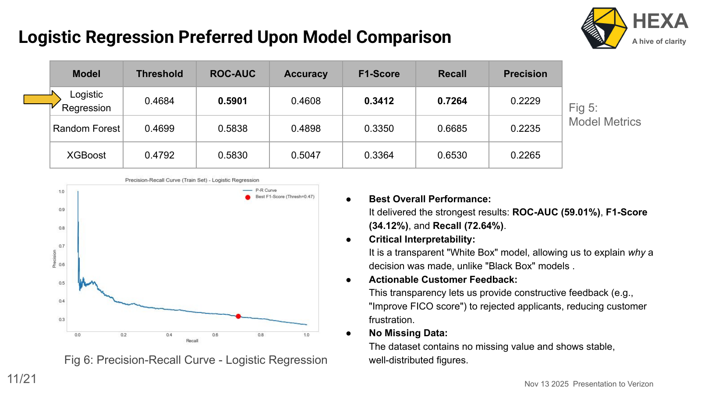
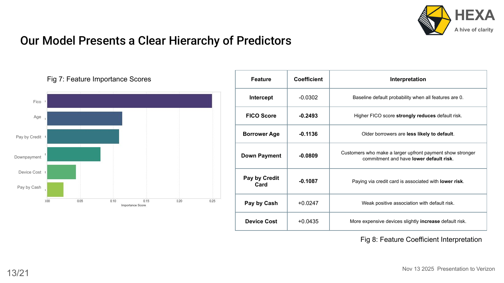
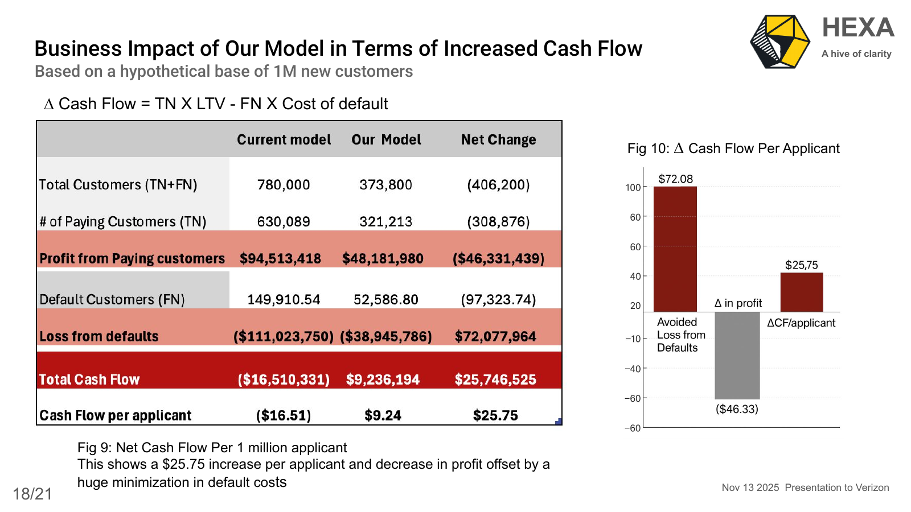

# Verizon Device Financing Default Risk Model

## Business Problem

This is my Verizon device-financing default risk project, completed as part of coursework at the **University of Chicago**. Verizon earns revenue by financing phones through customer payment plans, but loses money when customers become seriously delinquent or default on those payments. The business goal is to identify higher-risk applicants before approval and use model-driven thresholds to improve cash flow while still supporting customer growth.

Verizon device financing creates a practical tradeoff between growth and credit risk:

- Approving more customers can increase revenue.
- Approving high-risk customers can increase default losses.
- Rejecting too many customers can reduce sales and customer growth.

The goal was to identify a model that predicts 90-day delinquency/default risk and supports a business decision threshold that balances sales growth against expected losses.

This repository includes the final presentation, EDA report, selected business visuals, and a Python modeling workflow that implements the project methodology: preprocessing, class-weighted classification, model comparison, logistic regression interpretation, threshold selection, and cash-flow impact estimation.

## Modeling Approach

The project compared multiple classification models:

- Logistic Regression
- Random Forest
- XGBoost

Logistic regression was preferred because it provided the best overall balance of performance, recall, and interpretability in the project comparison. It also gave business stakeholders a clear explanation of why an applicant was considered risky, which matters for an operational credit decision.

## Key Predictors

The model focused on applicant and financing variables:

- FICO score
- Device cost
- Down payment
- Borrower age
- Payment type
- Application date
- 90-day delinquency/default target

The reports identified FICO score as the strongest predictor. Higher FICO scores reduced default risk, while higher device cost and cash payment behavior were associated with higher risk.

## Selected Visuals

### Logistic Regression Preferred Upon Model Comparison



The model comparison favored logistic regression because it achieved the strongest ROC-AUC, F1-score, and recall while staying transparent enough for business use.

### Clear Hierarchy of Predictors



The logistic regression coefficients created a clear risk hierarchy. FICO score had the strongest protective relationship, followed by borrower age, credit-card payment, and down payment.

### Business Impact in Terms of Increased Cash Flow



The business case translated model predictions into cash-flow impact. Based on the project assumptions, the model reduced default losses enough to create an estimated **$25.75 increase in cash flow per applicant** and approximately **$25.7M net cash-flow improvement per 1 million applicants**.

## Repository Contents

```text
.
├── assets/
│   ├── business-impact-cash-flow.png
│   ├── model-comparison-logistic-regression.png
│   └── predictor-hierarchy-feature-importance.png
├── reports/
│   ├── final_hexa_presentation_verizon.pdf
│   └── verizon_eda_mao_yining.pdf
├── src/
│   └── verizon_default_modeling_workflow.py
├── .gitignore
├── README.md
└── requirements.txt
```

## Technical Workflow in `src/`

The Python workflow is designed to be run once applicant-level data is available. It includes:

- CSV or Parquet data loading
- Date parsing and temporal feature creation
- Numeric imputation and standardization
- Categorical imputation and one-hot encoding
- Class-weighted logistic regression for imbalanced default outcomes
- Random forest model comparison
- Optional XGBoost model comparison if `xgboost` is installed
- Precision-recall threshold selection using F1-score
- ROC-AUC, accuracy, F1, recall, and precision reporting
- Logistic regression coefficient extraction for interpretability
- Cash-flow impact estimation using approval/default outcomes

The script expects fields similar to:

```text
fico
device_cost
down_payment
borrower_age
payment_type
application_date
del90
```

## How To Run

Install dependencies:

```bash
pip install -r requirements.txt
```

Run the workflow on a local applicant-level dataset:

```bash
python src/verizon_default_modeling_workflow.py --data data/verizon_applicants.csv
```

If the default target column has a different name:

```bash
python src/verizon_default_modeling_workflow.py --data data/verizon_applicants.csv --target your_target_column
```

## Notes

The raw Verizon applicant dataset is not included in this repository because it contains applicant-level financing records. The code in `src/` is organized so the modeling workflow can be run when the dataset is available locally.
